# AI — Repositório de Desenvolvimento

Repositório pessoal de engenharia com IA, construído ao longo do MBA em IA. Duas frentes:
o **material do curso** (prompt engineering, evaluation, versionamento) e uma **equipe de
desenvolvimento em agentes** montada a partir da curadoria dos melhores repositórios do ecossistema.

```
agents/     27 agentes — 24 do SDLC + 2 de incidente + 1 de integração externa
skills/     16 skills — os fluxos, a entrada por ticket e a disciplina da equipe
workflow/   3 hooks que impõem as fronteiras e registram o que acontece
tools/      8 scripts de apoio somente-leitura chamados pelos agentes
mcp/        como a equipe detecta o ferramental do projeto, em vez de assumir
prompts/    material do MBA + biblioteca de prompts versionada (PT e EN)
```

---

## A equipe

24 agentes genéricos — nenhum preso a linguagem ou framework. Cada um lê o perfil da stack do
repositório e segue as convenções que já existem lá.

| Fase | Agentes |
|---|---|
| **00 Orquestração** | tech-lead-orchestrator · project-analyst · context-manager |
| **01 Discovery** | product-owner · business-analyst · ux-researcher |
| **02 Design** | solution-architect · api-designer · data-architect · ux-ui-designer · threat-modeler |
| **03 Build** | backend · frontend · mobile · data · ai-engineer |
| **04 Quality** | test-engineer · code-reviewer · security-auditor · performance-engineer |
| **05 Delivery** | devops-engineer · sre-observability · release-manager |
| **06 Docs** | tech-writer |

Detalhes, curadoria e roster completo: [`agents/README.md`](agents/README.md).

## Seu fluxo de uso

Dois modos, dois comandos. Você não decora ordem de fase nenhuma — quem sabe onde parou é o disco.

```mermaid
flowchart LR
    SETUP(["/setup — uma vez, calibra a equipe para o projeto"]) -.-> A

    subgraph PLAN["1 · TRABALHO PLANEJADO — o portão protege a qualidade"]
        direction TB
        T["/sdlc-intake<br/>puxa a tarefa do tracker<br/>e traduz em objetivo"] --> A["/sdlc 'objetivo'"]
        A --> B{"em que fase<br/>os artefatos estão?"}
        B --> C["executa UMA onda<br/>agentes em paralelo"]
        C --> V["/verify-live<br/>sobe e verifica no navegador<br/>(onda de qualidade)"]
        V --> D{"portão"}
        D -->|bloqueado| F["devolve ao agente dono<br/>com o defeito específico"]
        D -->|aprovado| E["para e reporta<br/>+ report-back ao ticket"]
        F -. "corrigido, rode de novo" .-> A
        E -. "rode de novo<br/>para avançar" .-> A
    end

    E ==> P(["produção"])
    P == "quebrou" ==> G

    subgraph EMERG["2 · EMERGÊNCIA — o relógio corre, o portão atrapalha"]
        direction TB
        G["/incident 'sintoma'"] --> H["o que mudou em 24h<br/>já vem coletado, em 33 ms"]
        H --> I["fatos em 5 min<br/>+ severidade SEV1-4"]
        I --> J{"existe mitigação<br/>REVERSÍVEL?"}
        J -->|sim| K["mitiga e restaura<br/>SEM exigir causa raiz"]
        J -->|não| L["segue com<br/>o relógio à vista"]
        K --> M["causa raiz<br/>4 fases, 1 hipótese por vez"]
        L --> M
        M --> N["corrige<br/>teste de regressão primeiro"]
        N --> O["postmortem<br/>ações viram trabalho planejado,<br/>de volta ao /sdlc"]
    end

    NIGHT(["/nightly — fora do horário<br/>flaky · deps · docs-drift · gates"]) -. "achado vira trabalho" .-> T
```



As fases dentro de `/sdlc`:

| Onda | Produz | Portão |
|---|---|---|
| 00 bootstrap | perfil da stack · plano com ondas, donos e portões | plano executável |
| 01 discovery | PRD testável · regras de domínio · pesquisa UX | requisitos testáveis |
| 02 design | arquitetura + ADRs · contratos · modelo de dados · ameaças | design implementável |
| 03 build | código, com teste que falha primeiro | — |
| 04 quality | testes · review · segurança · performance | sem blockers |
| 05 delivery | observabilidade · pipeline · changelog | go / no-go com evidência |

Rodou `/sdlc` de novo, avança uma onda. `/sdlc-status` e `/sdlc-gate <n>` quando quiser olhar sem
avançar — ambos leem o disco, não a memória da conversa.

Comandos de apoio:

| Comando | Para |
|---|---|
| `/setup` | Calibrar a equipe para este projeto (rode depois de instalar) |
| `/sdlc-intake` | Puxar a tarefa do Jira/Linear/GitHub e devolver status para lá |
| `/verify-live` | Subir num ambiente controlado e verificar de verdade, no navegador |
| `/nightly` | Catálogo de trabalho recorrente fora do horário |

## O modo emergência

```
/incident "checkout retornando 500 desde as 14h"
```

Quando algo quebra em produção, o fluxo planejado atrapalha. `/incident` inverte as prioridades:

```
   ↓  fatos em 5 min      sintoma observável · impacto · desde quando · o que já mexeram
   ↓  severidade          SEV1–4 decide quanto processo roda
   ↓  MITIGAR             reversível, sem exigir causa raiz — rollback, flag, escalar, failover
   ↓  diagnosticar        4 fases, uma hipótese por vez, hipótese refutada fica registrada
   ↓  corrigir            só com causa confirmada, teste de regressão primeiro
   ↓  postmortem          por que não detectamos antes · por que passou no review
```

A regra que faz isso ser rápido **e** assertivo: **mitigar não é corrigir**. Mitigação é
reversível e dispensa causa raiz; correção exige causa raiz sempre. Confundir os dois é o que
produz o segundo incidente.

A evidência de "o que mudou nas últimas 24h" já vem coletada na abertura, em 33 ms.

Detalhes: [`skills/README.md`](skills/README.md) · [`workflow/README.md`](workflow/README.md).

### O que faz esse fluxo funcionar

Quatro mecanismos, e nenhum deles é "o prompt é bom":

1. **Contrato de artefato** — cada agente escreve num caminho fixo em `docs/sdlc/`, então a saída
   de um é literalmente a entrada do próximo. Sem passagem de contexto manual.
2. **Gates com evidência** — nenhuma onda avança sem que os artefatos da anterior existam e passem
   nos critérios. `tools/artifact-lint.sh` sai com código 1 quando um artefato está incompleto,
   o que torna o portão real e não uma sugestão.
3. **Fronteiras em runtime** — um hook nega, por caminho, que agentes de especificação escrevam
   código ou artefatos de outras fases. O que o frontmatter não consegue expressar, o hook impõe.
4. **Ferramental detectado, não assumido** — nenhum agente declara `tools:`, então todos herdam as
   ferramentas MCP da sessão. A skill `mcp-toolbelt` roda uma detecção no carregamento e injeta o
   ferramental **daquele** projeto: remotes git, CLIs, servidores MCP, manifests. Ajuste por
   projeto em `.claude/toolbelt.md`, que tem precedência sobre a detecção.

---

## Instalação

```bash
git clone <este repo> && cd ai
sudo apt install jq          # os hooks precisam
./agents/install.sh          # 1. cria os links
# reinicie o Claude Code, então:
/setup                       # 2. CALIBRA a equipe para este projeto
```

**Os dois passos são diferentes, e o segundo é o que importa.** Instalar cria links simbólicos —
a equipe chega sabendo o método e nada sobre o seu projeto. Calibrar detecta a stack, **executa**
o comando de teste e o de build para confirmar que funcionam de verdade, pergunta o que nenhuma
detecção alcança (VPN, o que não pode ser mexido, como se verifica uma mudança aqui) e grava tudo
em `.claude/toolbelt.md` — carregado por todo agente, em toda invocação.

Sem calibrar, o primeiro "os testes passam" pode ser falso porque nem existe suíte.

Rode `/setup` de novo quando a stack mudar — ou quando um agente errar por falta de contexto,
que é o sintoma de calibração velha.

Para amarrar um servidor MCP a este repositório em vez de globalmente:

```bash
claude mcp add --scope project <nome> <comando-ou-url>
claude mcp list    # confirme que conecta antes de contar com ele
```

Reinicie o Claude Code depois da primeira instalação.

Para usar a equipe em **outro** projeto:

```bash
./agents/install.sh --user   # agentes e comandos ficam disponíveis em todos os projetos
```

Os hooks ficam de fora nesse modo porque usam `${CLAUDE_PROJECT_DIR}` — copie
`workflow/settings.hooks.json` para o `.claude/settings.json` do projeto alvo e ajuste os caminhos.

---

## Material do MBA

`prompts/mba-ia-prompt-engineering/` — capítulos práticos: tipos de prompt, workflows de agentes,
versionamento com LangSmith, prompts enriquecidos (ITER-RETGEN) e evaluation.

`prompts/prompt-library/` e `prompts/prompt-library-en/` — biblioteca de prompts de produção
versionada, com datasets, avaliadores e schema de validação.

Setup por capítulo: [`prompts/mba-ia-prompt-engineering/AGENTS.md`](prompts/mba-ia-prompt-engineering/AGENTS.md).
