# AI — Repositório de Desenvolvimento

Repositório pessoal de engenharia com IA, construído ao longo do MBA em IA. Duas frentes:
o **material do curso** (prompt engineering, evaluation, versionamento) e uma **equipe de
desenvolvimento em agentes** montada a partir da curadoria dos melhores repositórios do ecossistema.

```
agents/     27 agentes — 24 do SDLC + 2 de incidente + 1 de integração externa
skills/     16 skills — os fluxos, a entrada por ticket e a disciplina da equipe
workflow/   3 hooks que impõem as fronteiras e registram o que acontece
tools/      11 scripts de apoio chamados pelos agentes e por você
secrets/    vault local: as credenciais saem do disco e o agente não tem o que ler
workspace/  os projetos onde você trabalha — cadastro e abertura de sessão
mcp/        como a equipe detecta o ferramental do projeto, em vez de assumir
docs/       dois diagramas interativos: como o repo é feito e como se usa
ideas/      o caderno da oficina: o que está pensado, em obra, e o que foi descartado
prompts/    material do MBA + biblioteca de prompts versionada (PT e EN)
```

**Este repositório é a oficina.** Nenhum trabalho de produto acontece aqui dentro — os projetos
ficam cadastrados em `workspace/` e a sessão abre dentro deles.

**Ver antes de ler:** [`docs/arquitetura.html`](docs/arquitetura.html) mostra como o repositório é
feito, [`docs/fluxo.html`](docs/fluxo.html) mostra como se usa. Tema claro/escuro e exportação.
Abra com `xdg-open docs/fluxo.html`.

---

## Começar

**Pré-requisitos:** `git`, o CLI `claude`, e `jq` — sem `jq` os hooks falham em modo aberto: não
bloqueiam nada e não registram nada.

```bash
sudo apt install jq
```

### 1. Instalar a oficina, uma vez

```bash
git clone <este repo> && cd ai
./agents/install.sh
```

Isso cria links simbólicos de `agents/` e `skills/` para `.claude/`, escreve os hooks e cria a
âncora `.claude/ai-toolkit`. **Reinicie o Claude Code** se `.claude/agents/` não existia antes.

### 2. Cadastrar um projeto

```bash
./workspace/go add /caminho/do/projeto
```

O nome sai do basename do caminho. `go` detecta sozinho qual dos dois formatos é:

| Tipo | O que é | Exemplo |
|---|---|---|
| **repo** | um repositório git | uma API, um app |
| **workspace** | raiz **sem** git, com repositórios embaixo | uma pasta com 11 serviços + 3 frontends que você trabalha junto |

No workspace, os artefatos do ciclo nascem na **raiz** e código e teste ficam em cada repositório.
É o formato certo quando você trabalha o conjunto — cadastrar cada repo em separado funciona, mas
obriga a uma sessão por repositório.

**Layout não é arquitetura.** Estar em dezessete repositórios ou em um só é história de time: os
scripts reportam onde o código está, nunca como o sistema é desenhado. Do git se tira uma coisa só
com honestidade — como o time versiona (`tools/git-conventions.sh`).

Se a raiz não tem git **nem** repositórios embaixo, `go` cadastra e avisa: os artefatos não ficam
versionados e `diff-scope.sh` / `incident-evidence.sh` não terão o que ler. Resolva com `git init`.

### 3. Abrir a sessão lá

```bash
./workspace/go <nome>
```

`go` fia o que faltar antes de abrir — instala a equipe em escopo de usuário, cria a âncora e
escreve os hooks no projeto alvo — e então abre o `claude` com o diretório de trabalho **no
projeto**. É idempotente: rodar de novo não duplica nada.

### 4. Calibrar, na primeira sessão de cada projeto

```
/setup
```

**Este é o passo que faz a equipe acertar, e o mais fácil de pular.** Instalar cria links: a
equipe chega sabendo o método e **nada** sobre o seu projeto. Calibrar detecta a stack, **executa**
o comando de teste e o de build para confirmar que funcionam de verdade, pergunta o que nenhuma
detecção alcança (VPN, o que não pode ser mexido, como se verifica uma mudança aqui) e grava tudo
em `.claude/toolbelt.md` — carregado por todo agente, em toda invocação.

Sem calibrar, o primeiro "os testes passam" pode ser falso porque nem existe suíte.

Rode `/setup` de novo quando a stack mudar — ou quando um agente errar por falta de contexto, que
é o sintoma de calibração velha.

### 5. Trabalhar

```
/sdlc "permitir que o cliente pause a assinatura"
```

Executa a próxima onda e **para no portão**. Rode de novo para avançar mais uma.

---

## Referência — `workspace/go`

Roda no shell, a partir da raiz deste repositório.

| Comando | Para |
|---|---|
| `./workspace/go` | Listar cadastro, tipo, estado da fiação e do fluxo de cada projeto |
| `./workspace/go add <caminho> [nome]` | Cadastrar. Aceita `~`. Nome padrão = basename, precisa ser kebab-case |
| `./workspace/go <nome> [args...]` | Fiar o que faltar e **abrir a sessão** no projeto |
| `./workspace/go wire <nome>` | Só fiar, sem abrir |
| `./workspace/go check <nome>` | Diagnóstico: tipo, fiação, âncora, hooks, calibração, fluxo, repositórios |
| `./workspace/go rm <nome>` | Descadastrar. Não toca no projeto |

Tudo que vem depois do nome vai direto para o `claude`, então dá para entrar já num fluxo:

```bash
./workspace/go crm "/sdlc-status"
./workspace/go crm "/sdlc 'permitir pausar assinatura'"
./workspace/go crm "/incident 'checkout 500 desde as 14h'"
```

O cadastro fica em `workspace/projects/<nome>.md` — frontmatter para a máquina, corpo livre para
suas anotações. Não é versionado: guarda caminhos absolutos desta máquina.

Detalhes e as decisões de desenho: [`workspace/README.md`](workspace/README.md).

## Referência — comandos dentro da sessão

**Os três que sustentam o trabalho planejado:**

| Comando | Argumento | Para |
|---|---|---|
| `/sdlc` | `[objetivo]`, ou vazio para continuar | Executa a próxima onda e para no portão |
| `/sdlc-status` | — | Onde o trabalho parou, lido do disco |
| `/sdlc-gate` | `[1\|2\|3\|4]` | Valida um portão item a item, com evidência |

**Apoio:**

| Comando | Argumento | Para |
|---|---|---|
| `/setup` | — | Calibrar a equipe para este projeto |
| `/sdlc-intake` | `[chave do ticket]` | Puxar do Jira/Linear/GitHub/GitLab e devolver status para lá |
| `/verify-live` | `[o que verificar]` | Subir num ambiente controlado e verificar de verdade, no navegador |
| `/nightly` | `[rotina]`, ou vazio para listar | Trabalho recorrente fora do horário |
| `/incident` | `[sintoma observado]` | Modo emergência |

**Também aparecem na lista, mas não é assim que o fluxo foi desenhado:** `/sdlc-bootstrap`,
`/sdlc-discovery`, `/sdlc-design`, `/sdlc-build`, `/sdlc-quality` e `/sdlc-ship`. São as skills de
fase, carregadas pelo `/sdlc`. Digitar a fase direto pula o portão — quem escolhe a onda é o
`/sdlc`, lendo os artefatos.

Você também pode acionar um especialista direto, sem fluxo:

```
Use o security-auditor para auditar o fluxo de upload
Use o tech-lead-orchestrator para planejar <objetivo>
```

## Um dia de trabalho

```bash
./workspace/go                       # onde eu parei em cada projeto?
./workspace/go crm "/sdlc-status"    # e neste, especificamente?
./workspace/go crm                   # abre a sessão
```

Dentro da sessão:

```
/sdlc-intake PROJ-482       # puxa o ticket e traduz em objetivo
/sdlc "<o objetivo>"        # onda 00: perfil da stack + plano
/sdlc                       # onda 01: PRD, regras de domínio, UX
/sdlc-gate 1                # o portão passou mesmo? confira sem avançar
/sdlc                       # onda 02: arquitetura, contratos, ameaças
/sdlc                       # onda 03: código, com teste que falha primeiro
/verify-live "o fluxo de pausa"   # sobe e verifica no navegador
/sdlc                       # onda 04: testes, review, segurança, performance
/sdlc                       # onda 05: observabilidade, pipeline, go/no-go
```

Você não decora a ordem: `/sdlc` sem argumento continua de onde parou, porque **quem sabe onde
parou é o disco**, não a memória da conversa.

---

## A equipe

27 agentes genéricos — nenhum preso a linguagem ou framework. Cada um lê o perfil da stack do
repositório e segue as convenções que já existem lá.

| Fase | Agentes |
|---|---|
| **00 Orquestração** | tech-lead-orchestrator · project-analyst · context-manager |
| **01 Discovery** | product-owner · business-analyst · ux-researcher |
| **02 Design** | solution-architect · api-designer · data-architect · ux-ui-designer · threat-modeler |
| **03 Build** | backend · frontend · mobile · data · ai-engineer · integration-engineer |
| **04 Quality** | test-engineer · code-reviewer · security-auditor · performance-engineer |
| **05 Delivery** | devops-engineer · sre-observability · release-manager |
| **06 Docs** | tech-writer |
| **07 Incidente** | incident-commander · root-cause-analyst |

O `integration-engineer` atua em duas ondas: desenha a interface interna na 02, implementa o
adapter do fornecedor na 03. Os dois de incidente não são uma fase — entram por `/incident`.

Detalhes, curadoria e roster completo: [`agents/README.md`](agents/README.md).

## O ciclo

```mermaid
flowchart LR
    SETUP(["/setup — uma vez, calibra a equipe para o projeto"]) -.-> A

    subgraph PLAN["1 · TRABALHO PLANEJADO — o portão protege a qualidade"]
        direction TB
        T["/sdlc-intake<br/>puxa a tarefa do tracker<br/>e traduz em objetivo"] --> A["/sdlc 'objetivo'"]
        A --> B{"em que fase<br/>os artefatos estão?"}
        B --> C["executa UMA onda<br/>agentes em paralelo"]
        C --> V["/verify-live<br/>sobe e verifica no navegador<br/>(onda de qualidade)"]
        V --> D{"portão"}
        D -->|bloqueado| F["devolve ao agente dono<br/>com o defeito específico"]
        D -->|aprovado| E["para e reporta<br/>+ report-back ao ticket"]
        F -. "corrigido, rode de novo" .-> A
        E -. "rode de novo<br/>para avançar" .-> A
    end

    E ==> P(["produção"])
    P == "quebrou" ==> G

    subgraph EMERG["2 · EMERGÊNCIA — o relógio corre, o portão atrapalha"]
        direction TB
        G["/incident 'sintoma'"] --> H["o que mudou em 24h<br/>já vem coletado na abertura"]
        H --> I["fatos em 5 min<br/>+ severidade SEV1-4"]
        I --> J{"existe mitigação<br/>REVERSÍVEL?"}
        J -->|sim| K["mitiga e restaura<br/>SEM exigir causa raiz"]
        J -->|não| L["segue com<br/>o relógio à vista"]
        K --> M["causa raiz<br/>4 fases, 1 hipótese por vez"]
        L --> M
        M --> N["corrige<br/>teste de regressão primeiro"]
        N --> O["postmortem<br/>ações viram trabalho planejado,<br/>de volta ao /sdlc"]
    end

    NIGHT(["/nightly — fora do horário<br/>flaky · deps · docs-drift · gates"]) -. "achado vira trabalho" .-> T
```



As ondas dentro de `/sdlc`:

| Onda | Produz | Portão |
|---|---|---|
| 00 bootstrap | perfil da stack · plano com ondas, donos e portões | plano executável |
| 01 discovery | PRD testável · regras de domínio · pesquisa UX | requisitos testáveis |
| 02 design | arquitetura + ADRs · contratos · modelo de dados · ameaças | design implementável |
| 03 build | código, com teste que falha primeiro | — |
| 04 quality | testes · review · segurança · performance | sem blockers |
| 05 delivery | observabilidade · pipeline · changelog | go / no-go com evidência |

## O modo emergência

```
/incident "checkout retornando 500 desde as 14h"
```

Quando algo quebra em produção, o fluxo planejado atrapalha. `/incident` inverte as prioridades:

```
   ↓  fatos em 5 min      sintoma observável · impacto · desde quando · o que já mexeram
   ↓  severidade          SEV1–4 decide quanto processo roda
   ↓  MITIGAR             reversível, sem exigir causa raiz — rollback, flag, escalar, failover
   ↓  diagnosticar        4 fases, uma hipótese por vez, hipótese refutada fica registrada
   ↓  corrigir            só com causa confirmada, teste de regressão primeiro
   ↓  postmortem          por que não detectamos antes · por que passou no review
```

A regra que faz isso ser rápido **e** assertivo: **mitigar não é corrigir**. Mitigação é
reversível e dispensa causa raiz; correção exige causa raiz sempre. Confundir os dois é o que
produz o segundo incidente.

A evidência de "o que mudou nas últimas 24h" já vem coletada na abertura, em algumas dezenas de
milissegundos.

Detalhes: [`skills/README.md`](skills/README.md) · [`workflow/README.md`](workflow/README.md).

## Onde as coisas ficam

No **projeto alvo**, não aqui:

```
docs/sdlc/
├── 00-orchestration/  plan.md · stack-profile.md · MANIFEST.md · artifact-ledger.tsv
├── 01-discovery/      prd.md · domain.md · ux-research.md
├── 02-design/         architecture.md · adr/ADR-NNN-*.md · api/ · data-model.md
│                      ux-spec.md · threat-model.md
├── 03-build/          implementation-log.md · data-pipelines/ · ai/
├── 04-quality/        test-plan.md · review-*.md · security-audit.md · performance-*.md
├── 05-delivery/       pipeline.md · observability.md · release-*.md
└── 06-docs/           doc-status.md

docs/incidents/<data>-<slug>/    incident.md · root-cause.md   (fora do sdlc: não é uma fase)

.claude/toolbelt.md      a calibração do /setup — versione, é contexto de time
.claude/settings.json    os hooks apontando para a âncora
.claude/ai-toolkit       link para esta oficina
.claude/logs/guard.tsv   toda negação de fronteira, com carimbo de tempo
```

Num **workspace**, essa árvore fica na raiz e descreve o sistema. Código, teste e o histórico de
cada serviço ficam no repositório do membro:

```
smart/                        ← a sessão abre aqui
├── docs/sdlc/                ← PRD, arquitetura, ADRs, contratos ENTRE membros
├── .claude/                  ← toolbelt, hooks, âncora
├── micro-services/dafe-pix/  ← repo próprio: código, teste, git, deploy
├── micro-services/dafe-gateway/
└── front-end/solve-report/
```

## Quando algo falha

| Sintoma | Comando |
|---|---|
| "Será que este projeto está fiado?" | `./workspace/go check <nome>` |
| Mexi em `agents/`, `skills/` ou `workflow/` | `./agents/install.sh --check` |
| Um agente afirma coisa errada sobre o projeto | `/setup` — calibração velha |
| Não sei em que fase o trabalho está | `/sdlc-status` |
| "O portão passou mesmo?" | `/sdlc-gate <n>` |
| Servidor MCP não responde | `claude mcp list` — configurado ≠ conectado |
| Hooks não bloqueiam nada | `command -v jq` — sem `jq` eles falham em modo aberto |

Os scripts de `tools/` também rodam direto no shell, sem sessão. Os nove primeiros são somente
leitura; `restrict.sh` é o único que escreve, e só na sua configuração pessoal:

```bash
tools/repo-facts.sh              # manifests, versões, comandos declarados, estado do git
tools/diff-scope.sh [base]       # escopo do diff e áreas de risco
tools/sdlc-state.sh              # fase atual lida do disco
tools/artifact-lint.sh [fase]    # sai com código 1 quando o artefato está incompleto
tools/incident-evidence.sh 24    # o que mudou nas últimas 24h
tools/git-conventions.sh         # formato de commit, branch e MR do time
tools/secret-scan.sh             # onde estão as credenciais; sai 1 se houver segredo no git
tools/restrict.sh                # escolhe o que o agente não pode ler
```

## Credenciais

`.env` no disco é arquivo que o agente lê. `secrets/` sobe um Vault local onde as credenciais deste
ambiente ficam guardadas, e um wrapper as entrega **direto ao processo que precisa delas** — o token
de MCP nunca vira arquivo nem entra no ambiente da sessão, então nenhum `Bash` do agente o herda.

```bash
docker compose -f secrets/compose.yml up -d
secrets/vault-init          # uma vez
secrets/vault-unseal        # uma vez por boot — o GPG pede sua senha num popup
secrets/vault-put hostinger APITOKEN
secrets/wire-mcp            # mostra o diff; --apply para valer
```

Depois, `tools/restrict.sh` fecha o resto: aplica o mínimo e **deixa você escolher** o que mais o
agente não deve conseguir ler. Detalhes, e o que isto explicitamente **não** protege, em
[`secrets/README.md`](secrets/README.md).

Referência completa: [`tools/README.md`](tools/README.md).

Para amarrar um servidor MCP a um projeto em vez de globalmente:

```bash
claude mcp add --scope project <nome> <comando-ou-url>
claude mcp list    # confirme que conecta antes de contar com ele
```

Outras opções do instalador:

```bash
./agents/install.sh            # projeto: .claude/{agents,skills,settings.json} + âncora
./agents/install.sh --user     # global: ~/.claude/{agents,skills}
./agents/install.sh --check    # só valida, não instala
./agents/install.sh --no-hooks # agentes e skills, sem tocar em settings.json
```

## O que faz esse fluxo funcionar

Seis mecanismos, e nenhum deles é "o prompt é bom":

1. **Contrato de artefato** — cada agente escreve num caminho fixo em `docs/sdlc/`, então a saída
   de um é literalmente a entrada do próximo. Sem passagem de contexto manual.
2. **Gates com evidência** — nenhuma onda avança sem que os artefatos da anterior existam e passem
   nos critérios. `tools/artifact-lint.sh` sai com código 1 quando um artefato está incompleto,
   o que torna o portão real e não uma sugestão.
3. **Fronteiras em runtime** — um hook nega, por caminho, que agentes de especificação escrevam
   código ou artefatos de outras fases. O que o frontmatter não consegue expressar, o hook impõe.
4. **Ferramental detectado, não assumido** — nenhum agente declara `tools:`, então todos herdam as
   ferramentas MCP da sessão. A skill `mcp-toolbelt` roda uma detecção no carregamento e injeta o
   ferramental **daquele** projeto: remotes git, CLIs, servidores MCP, manifests. Ajuste por
   projeto em `.claude/toolbelt.md`, que tem precedência sobre a detecção.
5. **Um formato de projeto detectado, não declarado** — repo único e workspace multi-repo são
   reconhecidos em runtime pela mesma regra: raiz que é repositório git nunca é workspace. Os
   scripts que dependem de git percorrem os repositórios em vez de desistir, e o toolbelt reporta
   os remotes reais — dizer "sem remote git" com 17 repositórios seria uma afirmação falsa injetada
   em toda invocação de agente. O que esses scripts **não** fazem é inferir arquitetura do layout:
   dizem onde o código está, e avisam na própria saída que isso não descreve o desenho.
6. **Um caminho só para o toolkit** — skills e hooks alcançam `tools/` e `workflow/hooks/` por
   `${CLAUDE_PROJECT_DIR}/.claude/ai-toolkit/…`, uma âncora criada aqui pelo `install.sh` e em cada
   projeto pelo `workspace/go`. É o que permite o mesmo texto de skill funcionar nos dois lugares —
   e os hooks, que resolvem o projeto por variável de ambiente e não pelo próprio caminho, gravam
   o ledger no projeto alvo.

---

## Material do MBA

`prompts/mba-ia-prompt-engineering/` — capítulos práticos: tipos de prompt, workflows de agentes,
versionamento com LangSmith, prompts enriquecidos (ITER-RETGEN) e evaluation.

`prompts/prompt-library/` e `prompts/prompt-library-en/` — biblioteca de prompts de produção
versionada, com datasets, avaliadores e schema de validação.

Cada capítulo tem **um venv e um `requirements.txt` próprios** — nunca instale dependência na raiz.
Setup por capítulo: [`prompts/mba-ia-prompt-engineering/AGENTS.md`](prompts/mba-ia-prompt-engineering/AGENTS.md).
