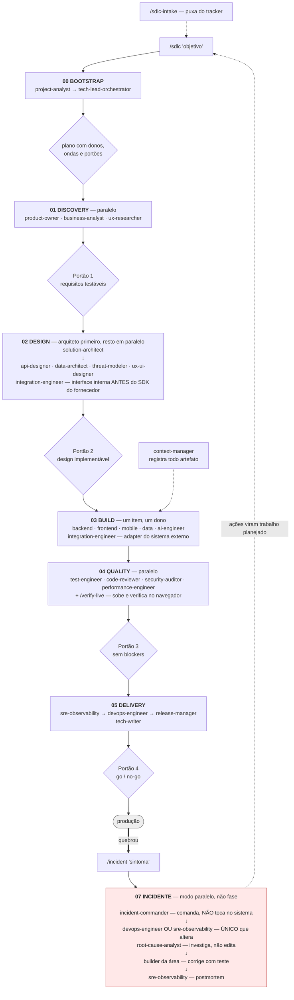

# Equipe de Desenvolvimento — Biblioteca de Agentes

Time completo de desenvolvimento em formato de subagentes do Claude Code, organizado pelas fases
do ciclo de vida de software. Genérico por design: nenhum agente é preso a uma linguagem ou
framework — cada um lê o `stack-profile` do repositório e segue as convenções que já existem lá.

---

## Como este time foi montado

Curadoria a partir dos repositórios de referência do ecossistema, pegando o que cada um faz melhor:

| Repositório | ⭐ | O que foi incorporado |
|---|---|---|
| [bmad-code-org/BMAD-METHOD](https://github.com/bmad-code-org/BMAD-METHOD) | 51.2k | Fluxo ágil por fases e cadeia de artefatos (PRD → arquitetura → épicos → stories) |
| [wshobson/agents](https://github.com/wshobson/agents) | 38.3k | Taxonomia de papéis e *tiering* de modelo (Opus/Sonnet/Haiku por complexidade) |
| [VoltAgent/awesome-claude-code-subagents](https://github.com/VoltAgent/awesome-claude-code-subagents) | 23.8k | Frontmatter padronizado e categorização por domínio |
| [contains-studio/agents](https://github.com/contains-studio/agents) | 12.4k | Organização por departamento e acionamento proativo via `description` |
| [vijaythecoder/awesome-claude-agents](https://github.com/vijaythecoder/awesome-claude-agents) | — | Roteamento: tech lead orchestrator + project analyst detectando a stack |
| [0xfurai/claude-code-subagents](https://github.com/0xfurai/claude-code-subagents) | ~1k | Seções consistentes: foco, método, checklist de qualidade, saída |
| [github/spec-kit](https://github.com/github/spec-kit) | — | Fases com portão: Specify → Plan → Tasks → Implement |
| [hesreallyhim/awesome-claude-code](https://github.com/hesreallyhim/awesome-claude-code) | — | Índice do ecossistema usado como base da varredura |

O que foi **adicionado** e não existe pronto nesses repositórios:

- **Contrato de artefato** por agente — cada um escreve num caminho fixo em `docs/sdlc/`, então a
  saída de um vira a entrada do próximo sem passagem de contexto manual.
- **Handoff explícito** — todo agente declara quem vem depois.
- **Boundaries** — o que cada agente tem proibido fazer, para evitar sobreposição e efeito colateral.
- **Quality gate** — checklist de autoverificação antes de devolver resultado.

---

## Fluxo do time



Três coisas nesse desenho fazem a diferença, e nenhuma é o time em si:

**Portões.** Nenhuma onda avança sem que os artefatos da anterior existam e passem nos critérios
(`skills/sdlc-gate/gates.md`). `tools/artifact-lint.sh` sai com código 1 quando o artefato é só o
esqueleto do template — o portão é real, não sugestão.

**Uma onda por invocação.** `/sdlc` executa a próxima onda e **para**. Quem decide avançar é você.

**Separação de comando e execução no incidente.** O `incident-commander` decide e registra; um
único agente altera o sistema. É a regra anti-*freelancing* do Google SRE, imposta pelo hook —
o comandante é bloqueado se tentar escrever fora de `docs/incidents/`.

---

## Roster (27 agentes)

24 do SDLC · 2 de incidente · 1 de integração externa. Distribuição de modelo: 12 opus, 14 sonnet,
1 haiku.

### 00 — Orquestração
| Agente | Modelo | Papel |
|---|---|---|
| `tech-lead-orchestrator` | opus | Decompõe o objetivo em plano de execução com ondas, donos e gates |
| `project-analyst` | sonnet | Detecta stack, arquitetura e convenções com evidência (path + linha) |
| `context-manager` | haiku | Mantém o `MANIFEST.md`: registro e cobertura dos artefatos |

### 01 — Discovery (*Specify*)
| Agente | Modelo | Papel |
|---|---|---|
| `product-owner` | opus | PRD, épicos, stories e critérios Given/When/Then testáveis |
| `business-analyst` | sonnet | Linguagem ubíqua, catálogo de regras, tabelas de decisão, KPIs |
| `ux-researcher` | sonnet | Personas, JTBD, jornada, auditoria heurística e de acessibilidade |

### 02 — Design (*Plan*)
| Agente | Modelo | Papel |
|---|---|---|
| `solution-architect` | opus | NFRs quantificados, C4, padrões de integração, ADRs com trade-offs |
| `api-designer` | opus | Contratos OpenAPI/GraphQL/proto/eventos, erros, paginação, versionamento |
| `data-architect` | opus | Modelo de dados, chaves, constraints, índices, migrações expand/contract |
| `ux-ui-designer` | sonnet | Especificação de telas, todos os estados, tokens, acessibilidade |
| `threat-modeler` | opus | STRIDE, fronteiras de confiança, casos de abuso, requisitos de segurança |

### 03 — Build (*Tasks + Implement*)
| Agente | Modelo | Papel |
|---|---|---|
| `backend-engineer` | sonnet | Implementação server-side em qualquer stack, seguindo o contrato |
| `frontend-engineer` | sonnet | Web: componentes, estados, dados, acessibilidade, testes |
| `mobile-engineer` | sonnet | iOS/Android/RN/Flutter: ciclo de vida, offline, permissões, loja |
| `data-engineer` | sonnet | Pipelines idempotentes, qualidade de dados, lineage, custo |
| `ai-engineer` | sonnet | LLM/RAG/agentes com eval set, baseline, guardrails, custo e latência |
| `integration-engineer` | sonnet | Fronteira com sistemas de terceiros: interface interna antes do SDK do fornecedor, falha externa como certeza |

O `integration-engineer` aparece em **duas** ondas: na 02 desenha a interface interna, antes de
qualquer linha colada na API do fornecedor; na 03 implementa o adapter. É o que impede que a forma
do terceiro vaze para dentro do sistema e trave a troca depois.

### 04 — Quality
| Agente | Modelo | Papel |
|---|---|---|
| `test-engineer` | sonnet | Estratégia e implementação de testes derivados dos critérios de aceite |
| `code-reviewer` | opus | Review com cenário de falha concreto por achado, ranqueado por severidade |
| `security-auditor` | opus | Auditoria do código real com caminho de ataque reproduzível |
| `performance-engineer` | opus | Profiling, load test e prova de melhoria com variância |

### 05 — Delivery
| Agente | Modelo | Papel |
|---|---|---|
| `devops-engineer` | sonnet | CI/CD reprodutível, IaC, segredos, deploy e rollback testado |
| `sre-observability` | opus | SLO/SLI, métricas, logs, traces, alertas acionáveis, postmortem |
| `release-manager` | sonnet | Decisão go/no-go com evidência, semver, changelog, rollout, rollback |

### 06 — Docs
| Agente | Modelo | Papel |
|---|---|---|
| `tech-writer` | sonnet | Documentação verificada comando a comando contra o código real |

### 07 — Incidente (modo paralelo, não fase)
| Agente | Modelo | Papel |
|---|---|---|
| `incident-commander` | opus | Segura o estado, classifica severidade, decide mitigação, mantém a linha do tempo. **Não toca no sistema** |
| `root-cause-analyst` | opus | Quatro fases de causa raiz, uma hipótese por vez. Investiga e propõe — não edita |

Estes dois não entram na sequência do SDLC: são acionados por `/incident` quando algo quebra em
produção. A separação entre comando e execução é a regra anti-*freelancing* do Google SRE, e aqui
ela é imposta pelo hook, não recomendada em prosa.

---

## Tiering de modelo

Herdado do padrão do `wshobson/agents`, com um critério explícito:

- **opus** — decisões irreversíveis ou de raciocínio adversarial: arquitetura, contratos, modelo de
  dados, ameaças, review, segurança, performance, confiabilidade.
- **sonnet** — execução e implementação: código, testes, pipelines, documentação.
- **haiku** — trabalho mecânico e de registro: `context-manager`.

Para trocar, edite o campo `model` no frontmatter. `inherit` usa o modelo da sessão principal.

---

## Contrato de artefatos

Todo agente escreve num caminho previsível — é isso que costura o fluxo:

```
docs/sdlc/
├── 00-orchestration/  plan.md · stack-profile.md · MANIFEST.md
├── 01-discovery/      prd.md · domain.md · ux-research.md
├── 02-design/         architecture.md · adr/ADR-NNN-*.md · api/ · data-model.md
│                      ux-spec.md · threat-model.md
├── 03-build/          implementation-log.md · data-pipelines/ · ai/
├── 04-quality/        test-plan.md · review-*.md · security-audit.md · performance-*.md
├── 05-delivery/       pipeline.md · observability.md · release-*.md
└── 06-docs/           doc-status.md
```

Incidente fica **fora** do `docs/sdlc/`, em `docs/incidents/<data>-<slug>/` — é o caminho que o
hook impõe, e a separação existe porque incidente não é uma fase do ciclo planejado: nasce a
qualquer momento e tem ciclo próprio.

---

## Instalação

Os agentes só são carregados pelo Claude Code a partir de `.claude/agents/` (projeto) ou
`~/.claude/agents/` (todos os projetos). Esta pasta é a fonte versionada; o script cria os links —
e também instala as skills de [`skills/`](../skills/README.md) e os hooks de
[`workflow/`](../workflow/README.md).

```bash
./agents/install.sh            # projeto: .claude/{agents,skills,settings.json} + âncora ai-toolkit
./agents/install.sh --user     # global: ~/.claude/{agents,skills}
./agents/install.sh --check    # só valida, não instala
./agents/install.sh --no-hooks # agentes e skills, sem tocar em settings.json
```

Em qualquer modo o script cria a âncora `.claude/ai-toolkit` na raiz deste repositório — o caminho
por onde skills e hooks alcançam `tools/` e `workflow/hooks/`.

Depois de instalar, reinicie o Claude Code se `.claude/agents/` não existia antes.

**Para trabalhar em outro projeto**, não instale à mão: cadastre e abra pelo
[`workspace/`](../workspace/README.md), que fia a âncora, os hooks e o escopo de usuário de uma vez.

```bash
./workspace/go add /caminho/do/projeto
./workspace/go <nome>
```

## Uso

Pelo fluxo completo, com um comando só:

```
/sdlc "cobrança multi-tenant com pausa de assinatura"
```

Ele descobre a fase pelos artefatos, executa a próxima onda e para no portão. Rode de novo para
avançar. Ver [`skills/README.md`](../skills/README.md).

Ou acionando um especialista direto:

```
Use o security-auditor para auditar o fluxo de upload
Use o tech-lead-orchestrator para planejar <objetivo>
```

A delegação também acontece sozinha: a `description` de cada agente descreve quando ele deve ser
acionado, com exemplos.

## Modelo de capacidade

Nenhum agente declara `tools:`. Isso é deliberado: a documentação é explícita — usar `tools` como
allowlist **remove todas as ferramentas MCP** do subagente. Na primeira versão desta biblioteca
todos tinham allowlist, e o resultado era uma equipe cega para Figma, Playwright, Context7,
GitLab e toda a infraestrutura configurada na máquina.

O modelo agora é **capacidade ampla, restrição por caminho**:

| Camada | O que faz |
|---|---|
| Herança | Todo agente recebe as ferramentas built-in **e as MCP** da sessão |
| `disallowedTools` | Em `code-reviewer`, `security-auditor` e `root-cause-analyst`: sem `Edit`/`NotebookEdit` — quem investiga ou revisa não altera o que está analisando |
| Hook `guard-artifacts.sh` | Agentes de especificação só escrevem no diretório da própria fase; `MANIFEST.md` só aceita o `context-manager` — despachado com esse `subagent_type`, não com apelido: o hook compara a identidade, e um `manifest-keeper` é negado como qualquer outro |
| Seção `Boundaries` | O limite de julgamento, para o que caminho nenhum expressa |

Agentes que legitimamente alteram o sistema — builders, `test-engineer`, `devops-engineer`,
`sre-observability`, `performance-engineer`, `release-manager`, `tech-writer` — não são
restringidos por caminho. Para eles o limite é o `Boundaries`.

## Ferramentas e MCP

Duas skills vêm pré-carregadas no frontmatter, e é onde mora o que antes estava duplicado dentro
de cada agente:

**[`engineering-discipline`](../skills/practices/engineering-discipline/SKILL.md)** — nos 27.
Evidência antes de afirmação, ler antes de escrever, teste que falha primeiro, nunca enfraquecer
o sinal, honestidade sobre limites. Existe porque a medição mostrou o custo de repetir a mesma
regra em cada agente: "rode antes de afirmar" aparecia em 6, "teste que falha primeiro" em 1.

**[`mcp-toolbelt`](../skills/practices/mcp-toolbelt/SKILL.md)** — em 26 (fora o `context-manager`,
que só registra artefato e não fala com sistema externo). Não declara quais ferramentas existem:
roda uma detecção no carregamento (~28 ms medidos neste repositório) e injeta o ferramental real do
projeto atual. Ajuste por projeto em `.claude/toolbelt.md`, que tem precedência sobre a detecção.

Mecanismo de detecção: [`mcp/README.md`](../mcp/README.md).
Scripts locais que todo agente tem, com ou sem MCP: [`tools/README.md`](../tools/README.md).

## Convenções de escrita dos agentes

Se for adicionar um agente novo, mantenha o mesmo formato:

1. Frontmatter com `name`, `description` (com exemplos `<example>` de quando acionar), `model`,
   `color` e `skills`.
2. Corpo com: Mission · When you are engaged · Required inputs · Method · Standards ·
   Quality gate · Output contract · Handoff · Boundaries.
3. **Não declare `tools:`** — allowlist remove todas as ferramentas MCP do subagente, que é
   exatamente o erro que a versão anterior cometeu. Para tirar capacidade de escrita use
   `disallowedTools`; para limitar por caminho, o hook.
4. Toda saída vai para um caminho fixo em `docs/sdlc/` — ou `docs/incidents/`, no modo emergência.
5. Corpo dos agentes em inglês (consistência com o ecossistema e com os agentes do capítulo 4 do
   MBA); documentação do repositório em português.

Referência oficial do formato: [Claude Code — Subagents](https://code.claude.com/docs/en/sub-agents).
